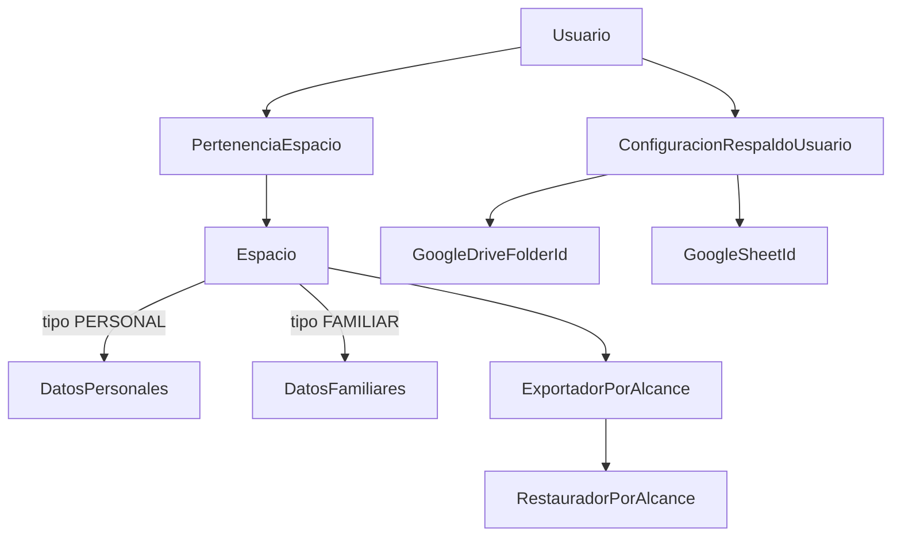

# Plan Multitenant + Entorno A/B (sin implementación)

Este documento consolida todo lo conversado para que puedas retomar cuando quieras, sin ejecutar cambios ahora.

## 1) Contexto y objetivo

La app partió con foco familiar y ahora necesita:

- Aislación total de datos para compartir con terceros.
- Usuarios solitarios (sin familia) como primer ciudadano.
- Familia opcional (entrar/salir sin perder operación personal).
- UI sin menús de familia para usuarios individuales.
- Respaldos y restauraciones personales (y también familiares cuando aplique).

Decisiones ya tomadas:

- Estrategia de tenant: **nuevo modelo `Espacio/Tenant`** (no extender solo `Familia`).
- Alcance de respaldos/restauración: **completo en V1** (personal y familiar, restauración selectiva por alcance).

---

## 2) Plan maestro (arquitectura y ejecución por fases)

## Objetivo técnico

Evolucionar de un modelo centrado en familia a un esquema multi-espacio (personal/familiar) con aislamiento estricto por tenant, permisos por contexto y respaldo/restauración por alcance.

## Principios

- Aislamiento estricto por tenant en lectura/escritura.
- Compatibilidad progresiva durante migración.
- Configuración de respaldos a nivel usuario (no global).
- UI contextual según espacio activo.

## Arquitectura propuesta (alto nivel)



## Fase 1: Dominio multitenant

- Crear entidades:
  - `Espacio` (`PERSONAL|FAMILIAR`, nombre, activo, timestamps).
  - `PertenenciaEspacio` (usuario, espacio, rol, activo).
  - `ConfiguracionRespaldoUsuario` (Drive folder id, Sheet id, credenciales/tokens seguros).
- Mantener `Usuario.familia` temporalmente para compatibilidad.
- Reglas:
  - Todo usuario tiene 1 espacio personal.
  - Espacio familiar admite varios miembros.
  - Roles y permisos dependen del espacio activo.

## Fase 2: Tenant context transversal

- Resolver espacio activo por request (`X-Espacio-Id` o equivalente) validando pertenencia.
- Fallback seguro a espacio personal.
- Reemplazar filtros por `familia` con filtros por espacio/contexto.

## Fase 3: Migración de datos

- `Familia` actual -> `Espacio` tipo `FAMILIAR`.
- Cada usuario -> `Espacio` tipo `PERSONAL`.
- Crear pertenencias iniciales.
- Ajustar constraints/unique por alcance de espacio.

## Fase 4: Usuario solitario + familia opcional

- Onboarding sin invitación familiar obligatoria.
- Flujo "salir de familia y seguir personal":
  - quitar pertenencia familiar,
  - conservar espacio personal y continuidad.
- Mantener invitaciones familiares como función opcional.

## Fase 5: Backup/restore por alcance

- Dejar de operar sobre BD completa para estas acciones de usuario.
- Alcances explícitos:
  - `PERSONAL`
  - `FAMILIAR`
- Configuración Drive/Sheets desde perfil del usuario.
- Nombres y destinos segregados para evitar colisiones.

## Fase 6: UX por contexto

- Selector de espacio activo en frontend.
- Ocultar menús/rutas familiares en contexto personal o sin membresía familiar.
- Pantalla de configuración personal para:
  - `GOOGLE_DRIVE_BACKUP_FOLDER_ID`
  - `GOOGLE_SHEET_ID`
  - validación de conectividad.

## Fase 7: Pruebas y hardening

- Matriz de aislamiento:
  - usuario solo vs usuario familiar,
  - cruces entre espacios,
  - cruces entre usuarios/familias,
  - backup/restore por alcance.
- Tests de permisos y regresión de endpoints críticos.

## Fase 8: Rollout gradual y rollback

- Feature flags para activar por etapas:
  - contexto de espacio,
  - UI contextual,
  - backup/restore nuevo.
- Despliegue escalonado con rollback por fase.
- Limpieza final de deuda legacy (`familia` donde corresponda).

## Entregables esperados

- Multitenancy estable con espacios personal/familiar.
- Registro individual habilitado.
- Salida de familia con continuidad personal.
- Respaldos/restauración aislados por alcance.
- UI sin secciones familiares para usuarios individuales.

---

## 3) Operación local segura: dos BDs alternables (A/B)

Objetivo: tener un entorno estable (`A`) y otro de experimentación (`B`) para cambios multitenant.

## Esquema

- Proyecto compose A: `gastos_a`
- Proyecto compose B: `gastos_b`
- Variables por archivo:
  - `.env.a` (estable)
  - `.env.b` (experimental)

Esto separa volúmenes de Postgres automáticamente por nombre de proyecto.

## 3.1 Preparación

En `finanzas_app/backend/`, crea/ajusta:

- `.env.a`
- `.env.b`

Campos mínimos:

```env
DB_NAME=finanzas_db_a
DB_USER=finanzas_user_a
DB_PASSWORD=tu_password_a
SECRET_KEY=tu_secret_a
DEMO=false
```

```env
DB_NAME=finanzas_db_b
DB_USER=finanzas_user_b
DB_PASSWORD=tu_password_b
SECRET_KEY=tu_secret_b
DEMO=false
```

## 3.2 Levantar A y generar respaldo

```powershell
cd "c:\Users\jaime\Desktop\App gastos\gastos\finanzas_app\backend"
docker compose --env-file .env.a -p gastos_a up -d --build
```

```powershell
New-Item -ItemType Directory -Force -Path ".\backups" | Out-Null
docker compose --env-file .env.a -p gastos_a exec -T db sh -lc 'pg_dump -U "$POSTGRES_USER" -d "$POSTGRES_DB"' > ".\backups\dump_a.sql"
```

## 3.3 Levantar B y clonar datos desde A

Si quieres empezar B limpio:

```powershell
docker compose -p gastos_b down -v
```

Levantar B:

```powershell
docker compose --env-file .env.b -p gastos_b up -d --build
```

Restaurar dump en B:

```powershell
docker compose --env-file .env.b -p gastos_b exec -T db sh -lc 'psql -U "$POSTGRES_USER" -d "$POSTGRES_DB"' < ".\backups\dump_a.sql"
```

## 3.4 Migrar solo en B

```powershell
docker compose --env-file .env.b -p gastos_b exec web python manage.py makemigrations
docker compose --env-file .env.b -p gastos_b exec web python manage.py migrate
```

## 3.5 Alternar A/B rápidamente

Ir a B:

```powershell
docker compose -p gastos_a down
docker compose --env-file .env.b -p gastos_b up -d
```

Volver a A:

```powershell
docker compose -p gastos_b down
docker compose --env-file .env.a -p gastos_a up -d
```

## Nota sobre ejecución simultánea

Si quieres A y B levantados al mismo tiempo, debes usar puertos diferentes para el segundo stack (DB/API/frontend), por ejemplo:

- A: `5432`, `8000`, `5173`
- B: `5433`, `8001`, `5174`

Eso se resuelve con un archivo override para B.

---

## 4) Qué NO hacer por ahora

- No migrar producción/local principal directamente.
- No probar restore global sobre la BD estable.
- No mezclar variables globales de backup entre usuarios al validar la nueva arquitectura.

---

## 5) Siguiente paso sugerido cuando retomes

Empezar por una mini-etapa controlada:

1. Definir y crear modelos `Espacio` + `PertenenciaEspacio` + `ConfiguracionRespaldoUsuario`.
2. Resolver espacio activo en autenticación.
3. Migrar 1-2 endpoints críticos (lectura) para validar aislamiento.
4. Recién después avanzar a backup/restore por alcance.

