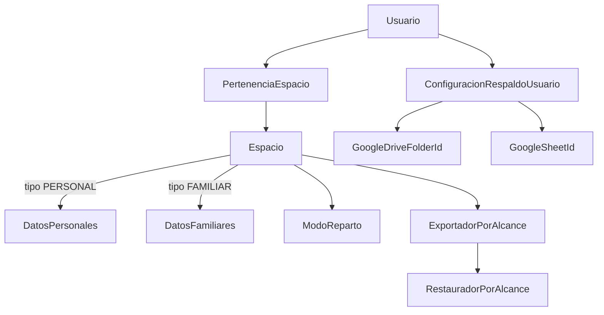

# Plan Multitenant + Entorno A/B

Plan aprobado, pendiente de implementación por fases. Consolida las decisiones de producto y la arquitectura para evolucionar la app de un modelo centrado en familia a multitenant nativo (espacios personales y familiares).

---

## 1) Contexto y objetivo

La app partió con foco familiar y ahora necesita:

- Aislación total de datos para compartir con terceros.
- Usuarios solitarios (sin familia) como primer ciudadano.
- Familia opcional (entrar/salir sin perder operación personal).
- UI sin menús de familia para usuarios individuales.
- Respaldos y restauraciones personales (y también familiares cuando aplique).

**Situación actual que habilita una estrategia agresiva:** solo hay 2 usuarios reales (con 4–5 meses de historia que preservar). Eso permite un cutover directo validado en entorno B, en lugar de un largo período de compatibilidad dual. Ver §4.

---

## 2) Decisiones de producto (cerradas)

### Estrategia de tenant
- Nuevo modelo **`Espacio`** (tipo `PERSONAL | FAMILIAR`), no extender `Familia`.
- Todo usuario tiene exactamente 1 espacio personal. Membresía familiar es opcional.

### Salida de una familia
- Los datos del espacio familiar **quedan como registro histórico** (solo lectura).
- Los datos se **recrean como copia** en los espacios personales de los usuarios relacionados:
  - Familia de **2 miembros**: la familia se disuelve; **una copia para cada uno**.
  - Familia de **3+ miembros**: **una copia solo para quien sale**; los que quedan mantienen la familia operativa con sus datos intactos.
- **Montos pendientes de saldar quedan vigentes** en las copias; el cuadre entre usuarios es **manual** (la app no liquida automáticamente).
- Las copias llevan marca de origen (`origen_familia`) para trazabilidad.

### Entrada a una familia
- Al entrar a otra familia se **parte de cero**: no se arrastran datos personales ni de familias anteriores al nuevo espacio familiar.

### Sistema de reparto de gastos (por espacio familiar)
- Configurable por espacio, con tres modos:
  - `PROPORCIONAL` — según ingresos (comportamiento actual, default).
  - `PARTES_IGUALES` — división en partes iguales.
  - `SIN_REPARTO` — sin repartición automática.

### UI para usuarios sin familia
- Un usuario sin familia puede **ocultar las interfaces familiares desde el menú de configuración** (además del ocultamiento automático por contexto).

### Respaldos
- Alcance completo en V1: personal y familiar, restauración selectiva por alcance.
- Configuración de destino **a nivel de usuario**, no global.
- Dos destinos: `DISPOSITIVO` (V1) y `DRIVE` del propio usuario (V2). Detalle en Fase 5.

---

## 3) Plan maestro por fases

### Principios

- **Aislamiento por defecto, no opt-in**: el framework debe hacer imposible olvidar el filtro de tenant, no depender de que cada view lo recuerde (hoy `finanzas/views.py` tiene ~140 filtros manuales por `familia`).
- Cada endpoint migrado incluye su **test de aislamiento en el mismo cambio** (no dejar los tests para el final).
- Configuración de respaldos a nivel usuario.
- UI contextual según espacio activo.

### Arquitectura (alto nivel)



### Fase 0 — Candados de seguridad previos

Obligatoria **antes de permitir cualquier usuario externo**, independiente del resto del plan:

- `POST /api/export/sheets/` (token `X-Export-Token` + cron de GitHub Actions) exporta **todas** las familias a un Sheet global: restringir a superuser o deshabilitar vía env flag hasta que exista el export por alcance (Fase 5).
- `descargar_dump` / `subir_dump_a_drive` permiten a un ADMIN de familia extraer la **BD completa** (todos los tenants): mismo tratamiento. `importar_dump` ya quedó protegido con `ALLOW_DB_IMPORT`.
- Registro abierto (necesario para "usuario solitario"): agregar throttle DRF al endpoint de registro + verificación de email, y cuota de espacios por usuario.

### Fase 1 — Dominio multitenant

- Crear entidades:
  - `Espacio` (`tipo PERSONAL|FAMILIAR`, nombre, `modo_reparto` (`PROPORCIONAL|PARTES_IGUALES|SIN_REPARTO`, default `PROPORCIONAL`, solo relevante en FAMILIAR), activo, archivado (para históricos de familias disueltas), timestamps).
  - `PertenenciaEspacio` (usuario, espacio, rol, activo).
  - `ConfiguracionRespaldoUsuario` (Drive folder id, Sheet id, tokens seguros).
- Crear base de aislamiento a nivel framework:
  - Modelo abstracto `TenantModel` con FK a `espacio` y manager cuyo `get_queryset()` **exige espacio explícito** (lanza error si no se pasa; nunca devuelve datos sin filtro de tenant).
  - Permission/decorador único que resuelve espacio activo + valida membresía una sola vez por request (reemplaza el patrón `AllowAny` + chequeo manual repetido).
- Reglas:
  - Todo usuario tiene 1 espacio personal (creado en el registro).
  - Espacio familiar admite varios miembros.
  - Roles y permisos dependen del espacio activo.

### Fase 2 — Contexto de tenant transversal

- Espacio activo por request vía header `X-Espacio-Id`, validando pertenencia.
- Reglas de resolución (importante):
  - **Sin header** → fallback al espacio personal (solo lecturas y escrituras explícitamente personales).
  - **Header inválido o sin membresía** → `403` explícito. **Nunca** degradar silenciosamente al espacio personal: una escritura que cae al tenant equivocado es corrupción de datos.
- Reemplazar filtros por `familia` con el manager de `TenantModel` (no con nuevos filtros manuales).
- Definir comportamiento de los servicios que asumen familia, por servicio:
  - `services/dashboard.py`, `services/presupuesto_mes.py`, `services_recalculo.py`, prorrateo/gasto común, `IngresoComun`:
    - En espacio `PERSONAL`: sin prorrateo ni gasto común; presupuesto y dashboard operan sobre un solo miembro.
    - En espacio `FAMILIAR`: respetar `modo_reparto` del espacio (`PROPORCIONAL` mantiene la lógica actual; `PARTES_IGUALES` divide por miembros activos; `SIN_REPARTO` desactiva el cálculo).

### Fase 3 — Migración de esquema y datos

- `Familia` actual → `Espacio` tipo `FAMILIAR`.
- Cada usuario → `Espacio` tipo `PERSONAL` (vacío).
- Crear pertenencias iniciales.
- Constraints a re-crear contra `espacio` (renombrar constraints con datos es delicado en PostgreSQL — hacerlo en migración dedicada y reversible):
  - `Presupuesto.unique_together [['familia','usuario','categoria','mes']]`
  - `InvitacionPendiente ('familia','email')`
- Comando de validación post-migración: conteos por tenant antes/después (movimientos, cuotas, presupuestos, etc.) — falla ruidosamente si no cuadran.
- Actualizar `seed_demo` y el workflow nightly (`reset-demo-nightly.yml`) para crear `Espacio`s; si no, la demo pública se rompe.

### Fase 4 — Salida de familia y usuario solitario

Implementa las reglas de producto de §2:

- Onboarding sin invitación obligatoria (requiere candados de Fase 0 activos).
- Flujo de salida:
  1. Snapshot del espacio familiar → marcar `archivado` (solo lectura) si la familia se disuelve (caso 2 miembros).
  2. Recrear copia de los datos en el espacio personal de quien corresponda (ambos si eran 2; solo el saliente si eran 3+), con nuevos IDs, FK al espacio personal y marca `origen_familia`.
  3. Cuotas y montos pendientes se copian vigentes; el cuadre es manual.
  4. Quitar la(s) pertenencia(s) familiar(es).
- Definir el catálogo exacto de qué se copia: movimientos, categorías, tarjetas, cuentas personales, cuotas, presupuestos, ingresos.
- Entrada a nueva familia: sin arrastre de datos (parte de cero).
- Mantener invitaciones familiares como función opcional.

### Fase 5 — Backup/restore por alcance

- Alcances explícitos: `PERSONAL` y `FAMILIAR`.
- **Formato**: export lógico filtrado por espacio (serialización de los datos del tenant, JSON o `.sql.gz` lógico). Nunca `pg_dump` — el dump lleva la BD completa con datos de todos los tenants y queda solo como herramienta de operación de la instancia (superuser, Fase 0).

**Destino `DISPOSITIVO` (V1 — sin credenciales, cero configuración):**

- El backend genera el archivo por alcance y el usuario lo descarga:
  - Móvil: `expo-file-system` + `expo-sharing` → el share sheet del sistema permite guardarlo en Descargas, Files, o su propio Drive/iCloud sin que la app necesite permisos de Google.
  - Web: descarga directa del navegador (mismo patrón que `descargar_dump`).
- Restauración: subir el archivo desde la app, por alcance (patrón similar a `importar_dump`).

**Destino `DRIVE` del propio usuario (V2 — respaldo automático):**

- Hoy el backup a Drive usa una sola cuenta global (`GOOGLE_DRIVE_OAUTH_*` de entorno en `drive_pg.py`); se reemplaza por OAuth por usuario:
  1. Botón "Conectar Google Drive" en el perfil → flujo OAuth con scope `drive.file` (solo archivos creados por la app) y `access_type=offline`.
  2. Refresh token **cifrado** en `ConfiguracionRespaldoUsuario`.
  3. Respaldos del espacio van a una carpeta en el Drive del usuario, con rotación (mantener N recientes, como hoy).
  4. Botón "Desconectar" que revoca el token.
- Nota: el login con Google vía Firebase **no sirve** para esto — Firebase Auth no entrega refresh tokens OAuth con scopes de Drive. Es un flujo OAuth separado con el mismo Client ID de Google Cloud ya configurado.
- Nombres y destinos segregados para evitar colisiones.
- **Retirar** los endpoints globales bloqueados en Fase 0 (o dejarlos solo-superuser para operación de la instancia).
- Rediseñar el cron de export de GitHub Actions: pasa de "un Sheet global con todo" a per-usuario/per-espacio, o se elimina en favor del export bajo demanda.

### Fase 6 — UX por contexto

- Selector de espacio activo en frontend y móvil.
- Ocultamiento automático de menús/rutas familiares en contexto personal o sin membresía.
- Toggle manual en configuración para ocultar módulos familiares (decisión de §2).
- Selector de `modo_reparto` en la configuración del espacio familiar.
- Pantalla de configuración personal para Drive folder, Sheet id y validación de conectividad.

### Fase 7 — Hardening final

Los tests de aislamiento se escriben **fase a fase** (cada endpoint migrado lleva el suyo). Esta fase cubre lo transversal:

- Test genérico parametrizado: "usuario B no ve datos del espacio de A en **ningún** endpoint registrado".
- Matriz de aislamiento: usuario solo vs familiar, cruces entre espacios, cruces entre familias, backup/restore por alcance, los tres modos de reparto.
- Regresión de endpoints críticos sobre la infra pytest existente (`backend/tests/`, factories en `conftest.py`).

---

## 4) Estrategia de cutover (simplificada para 2 usuarios)

Con solo 2 usuarios reales no se justifica un período largo de compatibilidad dual ni feature flags graduales:

1. **Backup completo** de la BD de producción (`pg_dump`) antes de todo.
2. Desarrollar y validar la migración completa en **entorno B** (ver §5) con una copia de los datos reales.
3. Verificar en B con el comando de validación de conteos (Fase 3) + smoke test manual de ambos usuarios.
4. Cutover directo en producción: ventana corta, aplicar migraciones, validar, seguir.
5. Rollback = restaurar el dump del paso 1.
6. `Usuario.familia` se mantiene **solo durante la ventana de migración** y se elimina inmediatamente después (no arrastrar deuda legacy).

La demo pública se regenera con `seed_demo` actualizado, sin migración de datos.

---

## 5) Operación local segura: dos BDs alternables (A/B)

Objetivo: entorno estable (`A`) y de experimentación (`B`) para los cambios multitenant.

### Esquema

- Proyecto compose A: `gastos_a` / archivo `.env.a` (estable)
- Proyecto compose B: `gastos_b` / archivo `.env.b` (experimental)

El nombre de proyecto separa los volúmenes de Postgres automáticamente. El `docker-compose.yml` actual exige `DB_PASSWORD` y `SECRET_KEY` vía env, así que los archivos `.env.a`/`.env.b` calzan directo con `--env-file`.

### 5.1 Preparación

En `finanzas_app/backend/`, crear:

```env
# .env.a
DB_NAME=finanzas_db_a
DB_USER=finanzas_user_a
DB_PASSWORD=tu_password_a
SECRET_KEY=tu_secret_a
DEMO=false
```

```env
# .env.b
DB_NAME=finanzas_db_b
DB_USER=finanzas_user_b
DB_PASSWORD=tu_password_b
SECRET_KEY=tu_secret_b
DEMO=false
```

### 5.2 Levantar A y generar respaldo

```powershell
cd "c:\Users\jaime\Desktop\App gastos\gastos\finanzas_app\backend"
docker compose --env-file .env.a -p gastos_a up -d --build
```

```powershell
New-Item -ItemType Directory -Force -Path ".\backups" | Out-Null
docker compose --env-file .env.a -p gastos_a exec -T db sh -lc 'pg_dump -U "$POSTGRES_USER" -d "$POSTGRES_DB"' > ".\backups\dump_a.sql"
```

### 5.3 Levantar B y clonar datos desde A

```powershell
# Empezar B limpio (opcional)
docker compose -p gastos_b down -v

docker compose --env-file .env.b -p gastos_b up -d --build

# Restaurar dump en B
docker compose --env-file .env.b -p gastos_b exec -T db sh -lc 'psql -U "$POSTGRES_USER" -d "$POSTGRES_DB"' < ".\backups\dump_a.sql"
```

### 5.4 Migrar solo en B

```powershell
docker compose --env-file .env.b -p gastos_b exec web python manage.py makemigrations
docker compose --env-file .env.b -p gastos_b exec web python manage.py migrate
```

### 5.5 Alternar A/B

```powershell
# Ir a B
docker compose -p gastos_a down
docker compose --env-file .env.b -p gastos_b up -d

# Volver a A
docker compose -p gastos_b down
docker compose --env-file .env.a -p gastos_a up -d
```

### 5.6 Ejecución simultánea (opcional)

Para tener A y B levantados a la vez, B necesita puertos distintos vía override:

```yaml
# docker-compose.override-b.yml
services:
  db:
    ports:
      - "5433:5432"
  web:
    ports:
      - "8001:8000"
  frontend:
    ports:
      - "5174:5173"
```

```powershell
docker compose --env-file .env.b -p gastos_b -f docker-compose.yml -f docker-compose.override-b.yml up -d
```

Recordar apuntar el frontend/móvil al puerto del stack activo (`VITE_API_URL` / `EXPO_PUBLIC_API_URL`).

---

## 6) Qué NO hacer

- No migrar producción/local principal directamente (todo pasa primero por B).
- No probar restore global sobre la BD estable.
- No abrir registro a terceros antes de completar la Fase 0.
- No mezclar variables globales de backup entre usuarios al validar la nueva arquitectura.
- No degradar silenciosamente a espacio personal ante un `X-Espacio-Id` inválido (siempre `403`).

---

## 7) Kickoff sugerido

Mini-etapa controlada, en orden:

1. **Fase 0** completa (candados sobre export/backup globales + throttle de registro). Es barata y desbloquea todo lo demás.
2. Modelos `Espacio` + `PertenenciaEspacio` + `ConfiguracionRespaldoUsuario` + `TenantModel` abstracto (Fase 1).
3. Resolver espacio activo en autenticación (Fase 2) y migrar 1–2 endpoints de lectura para validar el patrón de aislamiento con sus tests.
4. Recién después avanzar a migración de datos, salida de familia y backup/restore por alcance.
